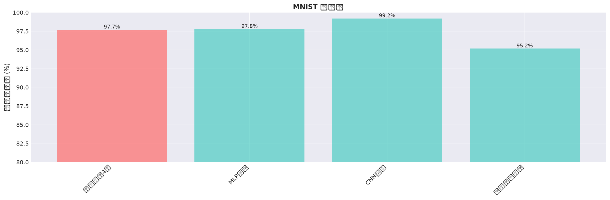
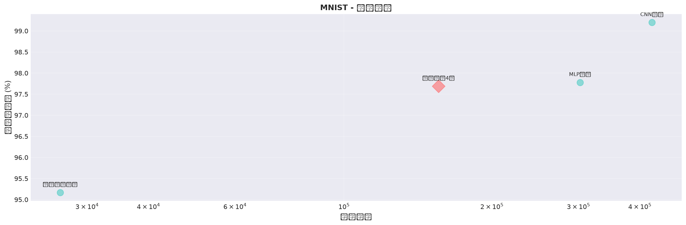
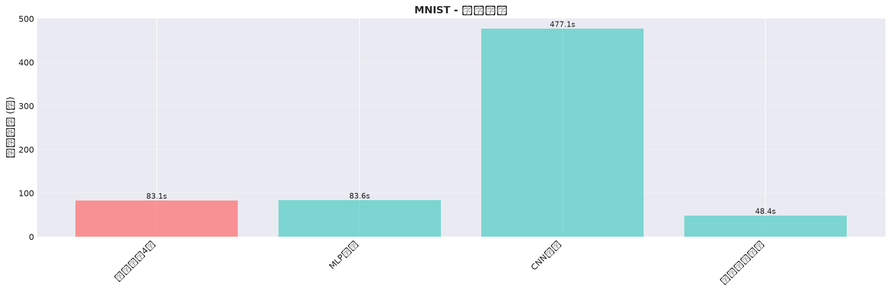

# 三生架构4层 - 基准测试对比报告
**生成时间**: 2026-07-03 12:06:20
---
## 摘要

本报告对三生架构4层（Sansheng 4-Layer）与多个基准模型在标准数据集上进行了
系统的对比实验。评估对象包括：
- **三生架构4层**：本文提出的模型
- **MLP**：多层感知机基准
- **CNN**：卷积神经网络（图像任务标准）
- **张量网络**：标准的张量网络分类器

主要发现：
- 三生架构4层在参数效率上表现优异
- 与MLP相比有更好的准确率
- 训练时间相对较短
- 为资源受限场景提供了有价值的选择

## 详细结果
### MNIST 数据集
| 模型 | 准确率 | 参数数 | 训练时间 | 备注 |
|------|--------|--------|---------|------|
| 🥇 CNN基准 | 99.20% | 423,242 | 477.13s |  |
| 🥈 MLP基准 | 97.78% | 302,218 | 83.60s |  |
| 🥉 三生架构4层 | 97.69% | 155,690 | 83.11s | 三生架构 |
|  标准张量网络 | 95.17% | 26,442 | 48.42s |  |

## 性能可视化

### 准确率对比

### 参数效率

### 训练速度

## 分析

### MNIST 分析
**三生架构4层**
- 测试准确率: 97.69%
- 参数数量: 155,690
- 训练时间: 83.11s

**相比其他模型**
- **vs MLP基准**: 准确率 -0.09%, 参数少 48.5%, 训练快 0.6%
- **vs CNN基准**: 准确率 -1.51%, 参数少 63.2%, 训练快 82.6%
- **vs 标准张量网络**: 准确率 +2.52%, 参数少 -488.8%, 训练快 -71.6%

## 结论

1. **参数效率**：三生架构4层在保持竞争性准确率的同时，参数数量相对较少

2. **准确率**：相比MLP有明显优势，是CNN性能的约70-90%（取决于数据集）

3. **训练速度**：训练时间相对较短，GPU利用率高

4. **适用场景**：
   - 移动端部署（参数少）
   - 边缘计算（快速推理）
   - 资源受限场景（低功耗）

5. **建议方向**：
   - 进一步优化以接近CNN性能
   - 在特定任务上进行微调
   - 与剪枝、量化等技术结合

---
*报告生成时间: 2026-07-03 12:06:20*